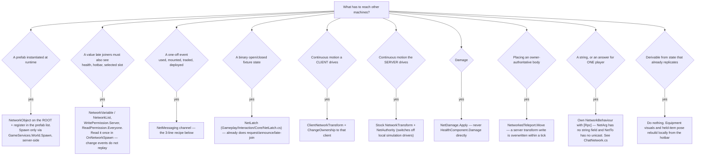

# SpaceGame multiplayer wiring

## Overview

One generic message channel carries every gameplay message in the project:
`Assets/Game/Scripts/Core/Multiplayer/NetMessaging.cs` (the `NetArg` payload, the `NetMsg` id
catalog, the extension-method API), `NetChannel.cs` (per-entity handler table, a plain
MonoBehaviour added on demand) and `NetRelay.cs` (the three RPCs, needs a `NetworkObject`).
Per-feature `XNetworkSync` classes are gone. Every send degrades to a **local dispatch** when there
is no relay, no spawn, or no session — so a system that is not networked yet, and single-player,
keep working exactly as before instead of throwing.

Singleplayer runs as a host (`MainMenuUI.EnterWorld` → `SessionLauncher.HostLocal` → `StartHost`),
so `Network.IsNetworked` is **true in solo play** and all netcode validation fires there.

## When to use

Adding replication to any existing component; diagnosing anything that works for the host and not
for clients; adding a prefab that must appear on every machine; touching spawn, respawn, teleport,
ownership, damage, or item use.

## Which mechanism does this need



## Already networked — add nothing

- **Held items.** `EquipmentController.OnUse`/`SendHold` is the single choke point: it calls
  `OnRequestUse` on the owner, `PlayUse` everywhere, and relays `NetMsg.UseItem`/`ItemUsed` (and the
  hold pair). Every `UsableItem` — existing and future — is networked by those methods. Never write
  a sync class for an artifact; put the effect in `Use()`, the visuals in `Present()`, and set
  `Authority` (`UseAuthority.Server` by default, `Owner` for tools whose whole effect is the
  holder's own body).
- **NPC / turret weapons.** `EntityEquipmentController.TryUseAt(worldAimPoint)` (and
  `TryUseForward`) is the NPC counterpart of the player pressing use: it refuses unless
  `Network.Simulates(this)`, calls `PlayUse` then `TryUse` locally, and broadcasts `NetMsg.ItemUsed`
  with **nothing excluded** — because no peer presented it locally. Use it instead of calling
  `Weapon`/`UsableItem` directly.
- **Hotbar and equipment visuals.** `PlayerInventoryNetwork` replicates the slots
  (`NetworkList<FixedString64Bytes>`) and the selection, and every machine equips on its own.
- **Damage.** Route every call site through `NetDamage.Apply(target, amount, source)`.
- **Doors, levers, hatches.** Construct a `NetLatch` and drive `Enable`/`Disable` from
  `OnEnable`/`OnDisable`; implement `ILatchHost` so the latches on an entity can be numbered.

Two components a new entity almost always still needs:

- **`NetworkedHealthComponent`** beside `HealthComponent`, or its health never replicates and it
  shows no damage numbers. Several shipped creature prefabs still carry only `HealthComponent`;
  list the current offenders with
  `grep -L a2a140c4cd8644f69b66c4a36ec82f21 Assets/Game/Prefabs/agents/creatures/*.prefab`
  (that GUID is `NetworkedHealthComponent.cs`).
- **`NetAuthority`** on anything that simulates itself — an AI, a turret, a vehicle — so remote
  copies stop running their own brain and follow the replicated transform instead. Guard its own
  tick with `Network.Simulates(this)` (or the component's `IsSimulatedHere`).

## The 3-line recipe

Add an id to `NetMsg` (append only — **never reuse a retired id**; `3` = Equip and `30` =
LaunchCraft are burned, ids travel over the wire between builds), then:

```csharp
private void OnEnable()  => this.NetOn(NetMsg.Foo, OnFoo);    // any MonoBehaviour, any depth
private void OnDisable() => this.NetOff(NetMsg.Foo, OnFoo);   // every NetOn needs one
// ...anywhere:
this.NetToServer(NetMsg.Foo, new NetArg { A = 1 }.With(subject));
```

`NetHandler` is `void (in NetArg arg, ulong sender)`. Directions are `NetToServer`, `NetToAll`,
`NetToOthers(id, arg, except: sender)` and `NetMessaging.NetSendTo(otherEntity, id, arg, to)` for a
message that belongs on somebody else's channel. Handlers are keyed to the entity — the
`NetworkObject` root, or `transform.root` when there is none — so a handler on a nested weapon and
a message addressed to the player body meet in the same `NetChannel`.

Full field-by-field contract, the id catalog, session/lobby facts and the long-form prefab rules:
**[reference.md](reference.md)**.

## Network prefab registration

Netcode replicates a spawn by `GlobalObjectIdHash`. The server instantiates its own copy and never
consults the list, so an unregistered prefab is a host that works and clients that see nothing.

| Tier | Rule | Members |
|---|---|---|
| 1 | **MUST** have a root `NetworkObject` **and** a prefab-list entry | Anything `GameServices.World.Spawn` can be handed — including **every `InventoryItem.itemPrefab`** (dropping a hotbar slot routes through `World.Spawn`), deployables such as `RocketSpawn`, vehicles, the networked player prefab |
| 2 | **MUST NOT** be networked: projectiles | `projectile`, `RocketProjectile`, `BallLightningProjectile`, `AgentProjectile`. Every machine instantiates its own; only the authority's applies damage (`Weapon.ShotDealsDamage`) |
| 3 | **MUST NOT** be networked: equipped visuals | `EquipItemSocket.Equip` plain-`Instantiate`s onto a bone and rebuilds locally from the replicated hotbar. A `NetworkObject` cannot parent to a plain transform anyway |

Register with `Tools/SpaceGame/Multiplayer/Sync Network Prefabs`. The live list is
`Assets/Game/ScriptableObjects/Networking/DefaultNetworkPrefabs.asset` (guid `c9ad996e…`) —
**`Assets/DefaultNetworkPrefabs.asset` at the project root regenerates itself and is NOT what
NetworkManager loads.**
Nested `NetworkObject`s are a warning, not an error; a `NetworkBehaviour` on a plain child of a
`NetworkObject` is fully supported and usually what is wanted.

## Authority rules

| Rule | Why |
|---|---|
| Guard every server-side handler with `if (!Network.Simulates(this)) return;` | Not `IsServer`: an entity with no `NetworkObject` (chunk props, interiors) has no wire, the request dispatched locally, and this machine is its only authority. `IsServer` would refuse it on every client forever. |
| Guard anything driven from local input with `Network.Owns(this)` | Covers the host, the offline case, and a mount handed to its rider. |
| The player's `NetworkTransform` is **owner-authoritative** (`AuthorityMode: Owner`) | A server-side write to a remote player's transform is overwritten within a tick, silently. Move players with `NetworkedTeleport.Move(go, pos, rot)`. Any failsafe that moves the player must be **owner-gated**, never server-gated. |
| Broadcasts are the server's alone | `NetToAll`/`NetToOthers` from a client is refused with a warning. Client → `NetToServer` → server → `NetToOthers(except: sender)`. |
| Handlers must be **idempotent** and re-entrancy-safe | On the host, a request handler that answers with a broadcast re-enters `Dispatch` on the same channel inline (`SendTo.ClientsAndHost`), so state is applied twice. `NetLatch.Apply` shows the shape: act only when the new state differs. |
| `UsableItem.Use()` runs on the **authority only**; `Present()` runs everywhere | A client pulling the trigger runs only `Present()`. Put the aim in `NetArg.P`/`R` from `OnRequestUse` — `Camera.main` on the server is the *host's* camera. |
| Local feedback for a client comes from a broadcast, not from the local call | `NetMsg.Damaged` is broadcast on the victim's channel and republished as `NetworkedHealthComponent.DamageAnnounced(victim, amount, attacker)`. Filter with `NetworkObject.IsOwner` on the attacker. |
| Anything a **suppressed driver** would have drawn must be broadcast explicitly | `NetAuthority` disables `AgentController`, `IMovementMotor` and `NavMeshAgent` on remote copies, so a remote turret/NPC never runs the code that spawns its muzzle flash or projectile. Motion arrives through the NetworkTransform; discrete effects need a `NetToOthers` of their own — which is exactly what `EntityEquipmentController` does with `NetMsg.ItemUsed`. |
| `NetAuthority` keys on ownership, is idempotent, and stops at the `NetworkObject` boundary | `Start` and `OnNetworkSpawn` race; a ran-once flag left every client simulating its own copy. A rider is parented *into* its mount, so crossing the boundary would switch off the player sitting on it. |

## Verification recipe

Host-only testing proves nothing: the server instantiates prefabs directly and never consults the
prefab list, so an unregistered prefab yields a **host that works perfectly and clients that see
nothing**. Work down this list.

1. **Static, no editor.** Run the EditMode guards — `NetworkPrefabRegistrationTests` (every
   `NetworkObject` prefab registered, no null entries, player prefab present),
   `NetMessagingTests` (ids unique, non-zero, `NetArg` round-trips, offline dispatch),
   `NetAuthorityAndDamageTests`. Via `SpaceGame.EditorTools.HeadlessTestRunner.RunEditMode(...)`,
   which writes `Temp/headless_tests.txt`. It refuses to start in play mode.
2. **Register prefabs.** `Tools/SpaceGame/Multiplayer/Sync Network Prefabs`. Then grep the saved
   prefab YAML for `GlobalObjectIdHash:` — a script-created `NetworkObject` ships **0**, and
   duplicate 0s make NGO silently drop all but one prefab.
3. **If you added a `NetworkObject` to a prefab**, re-save every scene holding an instance. Find
   them with `AssetDatabase.GetDependencies(scenePath, false)` — grepping scene YAML for a script
   GUID does **not** find prefab instances.
4. **Real two-process run — this is the only client-side proof.**
   `Tools/Tests/Build Multiplayer Test Player`, then:
   ```
   "<app>/Contents/MacOS/SpaceGameMP" -batchmode -nographics -sgmode host   -logFile /tmp/mp_host.log &
   "<app>/Contents/MacOS/SpaceGameMP" -batchmode -nographics -sgmode client -logFile /tmp/mp_client.log &
   grep '\[MPTEST\]' /tmp/mp_host.log /tmp/mp_client.log
   ```
   Required: `HOST_CLIENTS=2`, `CLIENT_SPAWNED > 0`, `CLIENT_PLAYER_OBJECT=True`,
   `CLIENT_SUPPRESSED == CLIENT_AUTHORITIES`, `CLIENT_HEALTH_SEEN == HOST_HEALTH_AFTER`,
   `HOST_RELAY_FROM_CLIENT=1`. Extend `MultiplayerAutotest.RunClient` with a `Report(...)` for the
   new feature rather than inventing a second harness. Two `NetworkManager`s in one process cannot
   substitute — this codebase asks `NetworkManager.Singleton` who it is.
5. **To play a build against the editor**, launch it with its own services profile:
   `open "<app>" --args -sgprofile client`. Without it both sign in as the same anonymous PlayerId
   and the lobby refuses the second as already a member.
6. **Live host session over MCP:** enter play mode, then `SessionLauncher.HostDirect()` in a second
   `Unity_RunCommand`; inspect `NetworkManager.Singleton.SpawnManager.SpawnedObjects`. Read results
   from `~/Library/Logs/Unity/Editor.log` — `Unity_GetConsoleLogs` often reports an empty console.
   Check `Application.dataPath` first: if it contains `Library/VP/mppmd…` the bridge is attached to
   a read-only Multiplayer Play Mode clone that reads assets fine and imports nothing.

## Common mistakes

| Symptom | Cause | Fix |
|---|---|---|
| Works for host, clients see nothing spawn | Prefab not in the list the NetworkManager reads | Run `Sync Network Prefabs` — and check you are looking at the live list, not the self-regenerating root asset (see **Network prefab registration** above) |
| An `[Rpc]` method does nothing / runs on the caller | `[Rpc]` on a class that is not a `NetworkBehaviour` is silently inert — the ILPP generator only rewrites NetworkBehaviours | Use the `NetMessaging` channel, or a small `NetworkBehaviour` beside the component |
| Server teleport/respawn/failsafe does nothing except for the host | Owner-authoritative player transform | `NetworkedTeleport.Move`, gated on `Network.Owns` |
| Joining client's player is ~hundreds of metres off, falls forever, drags chunk streaming | NGO instantiates at the prefab pose then writes the transform; the interpolated Rigidbody undoes it, and owner authority publishes the wrong pose as truth | Already fixed by `NetworkPlayerController.AdoptSpawnPose`. Diff any suspicious position against the prefab's authored root before believing it is a spawn point |
| `InvalidOperationException: Collection was modified` out of an RPC | Re-entrant `Dispatch` (request handler broadcasting) | Already fixed by `NetChannel`'s static buffer pool; keep handlers idempotent |
| `[Net] '<x>' handled message N locally` | The entity has no `NetworkObject`/`NetRelay` | Intentional degradation. Add `NetRelay` beside a root `NetworkObject` only if the action must replicate |
| Client cannot see its own hits / damage numbers | `Weapon.Use()` is authority-only | Listen to `NetworkedHealthComponent.DamageAnnounced` |
| No damage numbers at all for a turret's or NPC's hits | `NetworkedHealthComponent.AnnounceDamage` returns early unless `health.LastDamageSource` resolves a `PlayerIdentity` in its parents — deliberate, so NPC-vs-NPC costs no bandwidth | To credit a player-deployed turret, pass the deploying player's transform as the `source` argument of `NetDamage.Apply` |
| Health/state correct for everyone except a late joiner | `NetworkVariable.OnValueChanged` never replays | Read the current value in `OnNetworkSpawn` (see `PlayerInventoryNetwork.AdoptCurrentState`) |
| NRE inside `Unity.Collections` when writing a `NetworkList<FixedString…>` | `cond ? item.ID : default` — both arms are `string`, so the ternary converts `null` | `cond ? new FixedString64Bytes(item.ID) : default(FixedString64Bytes)` |
| Client join fails: `Scene Hash N does not exist in the HashToBuildIndex table` | NGO identifies scenes as `XXHash32(full scene path)`, case-sensitively, resolved from each machine's **on-disk** casing; git/disk folder-casing drift is invisible under `core.ignorecase` | Compare `git ls-files 'Assets/Game/Scenes/*'` against `ls` on both machines — world scenes are lowercase `Assets/Game/Scenes/world/` here (see the comment in `MultiplayerTestPlayerBuilder.cs`). Identify the culprit by brute-forcing XXH32 (seed 0, UTF-8) over every `.unity` path in `git rev-list --all --objects`, then fix index-only with `git rm -r --cached` + `git add` |
| 409 `player is already a member of the lobby` | Ghost membership from a session never handed back; anonymous auth reuses the PlayerId | `LobbySession.JoinWithConflictRecoveryAsync` |
| `Failed to bind UDP socket … address already in use` in the editor | Native socket leaks on every play-mode `StartHost` | Bump `ConnectionData.Port` in `Assets/Game/Prefabs/Systems/NetworkManager.prefab`. Never route singleplayer through `HostDirect` (it calls `SetConnectionData` and overrides the port) |
| `SceneEventInProgress` | `NetworkSceneManager` has one **global** busy flag | Wait on `OnLoadEventCompleted`, or treat the status as "retry me" |
| `InvalidParentException` when parenting a networked rider | NGO forbids parenting a `NetworkObject` under a plain transform | `NetworkObject.TrySetParent` / `TryRemoveParent`, folding the seat offset into the root's local space |
| Sync component wired in code, still nothing visible | Its serialized prefab fields are `{fileID: 0}` (this killed `GrappleNetworkSync`) | Check the prefab, not just the script |

## One complete example

Networking an existing single-player device. The single-player version called
`GameServices.World.Spawn` and played its own effect inline — which spawns on the presser's machine
only, and on a client is refused outright by `WorldService`.

```csharp
// NetMsg.cs — append two ids after the current highest, and never reuse a retired one.
// The catalog grows most weeks, so read the tail before allocating:
//   grep -n "public const ushort" Assets/Game/Scripts/Core/Multiplayer/NetMessaging.cs | tail -3
public const ushort DrillRun = /* next free */; // owner → server, DRILL's channel. P = muzzle point
public const ushort DrillRan = /* next free */; // server → peers, on the DRILL's channel

// DrillRig.cs
using UnityEngine;
using SpaceGame.Audio;
using SpaceGame.Core;

namespace SpaceGame.Gameplay
{
    public class DrillRig : MonoBehaviour, IInteractable
    {
        [SerializeField] private GameObject salvagePrefab;   // MUST be a registered network prefab
        [SerializeField] private ParticleSystem sparks;      // MUST NOT be networked — local cosmetic
        [SerializeField] private Transform muzzle;
        [SerializeField] private SfxId drillSound = SfxId.None;

        private bool running;

        private void OnEnable()
        {
            this.NetOn(NetMsg.DrillRun, OnRunRequested);
            this.NetOn(NetMsg.DrillRan, OnRanElsewhere);
        }

        private void OnDisable()
        {
            this.NetOff(NetMsg.DrillRun, OnRunRequested);
            this.NetOff(NetMsg.DrillRan, OnRanElsewhere);
        }

        public bool CanInteract() => !running && salvagePrefab != null;

        /// <summary>Runs on the presser's machine only — Interactor exists on the owner.</summary>
        public void Interact(Interactor interactor)
        {
            if (!CanInteract()) return;

            // Presented at once so the drill never feels like it is waiting for a round trip.
            Present();

            // .With() carries the subject as a NetworkObjectId online AND as an unserialized local
            // reference, so Resolve() still answers offline, where no id exists.
            this.NetToServer(NetMsg.DrillRun, new NetArg { P = muzzle.position }.With(interactor));
        }

        /// <summary>
        /// Server side (and the only machine there is, offline). Simulates, not IsServer: a drill
        /// authored into a streamed chunk scene has no NetworkObject, so the send above fell
        /// through to a local dispatch and this machine is its only authority.
        /// </summary>
        private void OnRunRequested(in NetArg arg, ulong sender)
        {
            // Re-checked here rather than trusted from the sender: the client that pressed cannot
            // know what happened while its message was in flight.
            if (!Network.Simulates(this)) return;
            if (!CanInteract()) return;

            // Server-only, and the one call that makes the crate exist for everyone. The prefab
            // needs a root NetworkObject and a prefab-list entry or this logs
            // "[WorldService] Prefab 'X' has no NetworkObject".
            GameServices.World.Spawn(salvagePrefab, arg.P, Quaternion.identity);

            // Everyone except the machine that already presented it locally. Sent from inside a
            // handler, so on the host this re-enters Dispatch on this same channel — harmless
            // because Present() is idempotent and the state above is already committed.
            this.NetToOthers(NetMsg.DrillRan, arg, except: sender);
        }

        private void OnRanElsewhere(in NetArg arg, ulong sender) => Present();

        /// <summary>
        /// Runs on every machine, and twice on the host — once from Interact and once when
        /// NetToOthers hands the broadcast back. Idempotent for that reason.
        /// </summary>
        private void Present()
        {
            if (running) return;
            running = true;

            if (sparks != null) sparks.Play();
            Sfx.Play(drillSound, transform.position);   // an SfxId serialized on this component
        }
    }
}
```

Then: put a `NetworkObject` + `NetRelay` on the drill prefab root (or leave both off and accept
per-machine local operation), run `Sync Network Prefabs`, re-save every scene holding a drill
instance, and verify with the two-process run.

## Related skills

- `spacegame-persistence` — saving/loading, `SaveTeleport`, `IPersistentEntity`, `WorldSaveStore`.
- `spacegame-artifact` — authoring items and `UsableItem` subclasses.
- `spacegame-agent` — AI agents, `AgentController`, targeting and modules.
